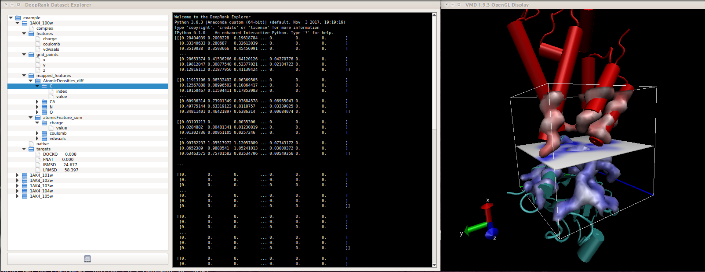

# DeepXplorer

Data browser for the HDF5 files created by deeprank. The GUI allows to easily explore file structure, view the target values and visualize the mapped features in either VMD or PyMol, plot the losses evolution during the training, make scatter plot of the ground truth VS predicion, plot the hit rate plo of the epocs .... In addition  the data can be loaded in an embedded iPython console for manipulation and analysis.

Warning you need to install h5xplorer brefore (https://github.com/DeepRank/h5xplorer)



## Installation

To use the browser you need to install

  * h5xplorer https://github.com/DeepRank/h5xplorer
  * PyQt5 ```conda install -c anaconda pyqt```
  * qtconsole ```python conda install -c anaconda ipython-qtconsole```
  * ipython ```conda install -c anaconda ipython```


To launch the tool using the example provided simply type in your console

```
./DeepXplorer.py
```


