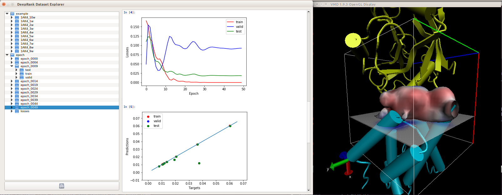

# DeepXplorer

Data browser for the HDF5 files created by deeprank. The GUI allows to easily explore file structure, view, the target values and visualize the mapped features in either VMD or PyMol. In addition an the data can be loaded in an embedded iPython console for manipulation and analysis. 

## Installation

To use the browser you need to install

  * PyQt5 ```conda install -c anaconda pyqt```
  * qtconsole ```python conda install -c anaconda ipython-qtconsole```
  * ipython ```conda install -c anaconda ipython```

## Usage

```
usage: DeepXplorer.py [-h] [-hdf5 HDF5]

Data Explorer for DeepRank

optional arguments:
  -h, --help  show this help message and exit
  -hdf5 HDF5  hdf5 file storing the data set

```

To launch the tool using the example provided simply type in your console

```
./DeepXplorer -hdf5 example.hdf5
```


